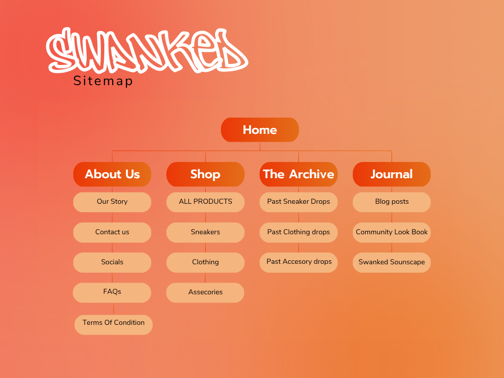

# Swanked Website Project

## 📌 Overview
This project is a multi-page website developed for **Swanked**, a South African streetwear and sneaker marketplace founded in 2013.  

The website translates a design proposal into a functional HTML-based site that reflects street culture, modern UI structure, and user engagement.

---

## 🎯 Objectives
- Create a structured multi-page website  
- Improve navigation and usability  
- Represent streetwear culture digitally  
- Implement engaging content (Journal, Lookbook, Soundscape)  
- Lay the foundation for future interactivity (theme toggle)

---

## 👥 Target Audience
- Gen Z and Millennials  
- Sneaker collectors  
- Urban fashion enthusiasts  

---

## 🌐 Website Pages

| Page | Description |
|------|------------|
| `index.html` | Homepage with intro and navigation |
| `shop.html` | Product display page |
| `about.html` | Brand info + contact form + social links |
| `features.html` | Website functionality overview |
| `journal.html` | Articles + Lookbook + Soundscape |
| `contact.html` | Contact form |

---

## ✨ Features
- Multi-page navigation  
- Semantic HTML structure  
- Contact form  
- Community Lookbook (images)  
- Audio player (Swanked Soundscape)  
- Consistent layout across pages  

---

## 🎨 Design Approach
- Streetwear-inspired aesthetic  
- Minimal, structured layout  
- Mobile-first planning  
- Grid-based layout concept  

### Colour Palette (Proposed)
- **Black** (#000000)  
- **White** (#FFFFFF)  
- **Orange** (#FF4500)  
- **Blue** (#2D5BFF)  

---

## ⚙️ Technologies Used
- HTML (structure)  
- CSS (planned for styling)  
- JavaScript (planned for interactivity)  

---

## 📁 Media Files
Make sure these files are included:
- `look1.jpg`, `look2.jpg`, `look3.jpg`  
- `soundscape.mp3`  
- (Optional) logo + product images  

---

## 🚀 Future Improvements
- Add CSS styling  
- Implement theme toggle (JavaScript)  
- Improve responsiveness  
- Add real product data  
- Connect to live social media  

---

## Sitemap

## 🎨 Design Philosophy & Architecture

### Theme Infrastructure
The user interface is built around a heavy photographic film aesthetic featuring two distinct view modes:
* **Nocturnal Mode (Default):** A sleek, black-out viewport (`#000000`) paired with sharp white typography and a blazing electric orange/red accent (`#ff4500`).
* **Inverted Mode:** A high-contrast negative film effect that flips dark and light values seamlessly while maintaining the iconic signature accent branding color.

---

 ## 📋Changelog

### ✅ Finished (Part 2 Layout & CSS)
* **Widescreen Brand Identity:** Implemented a full-width, edge-to-edge responsive header banner optimized to scale dynamically across viewports.
* **Component Encapsulation:** Refactored layout architecture using clean semantic groupings (`<header>`, `<section>`) bundled within container `
` elements for optimal Flexbox positioning.
* **Pure CSS State Management:** Engineered a fully functional theme toggle utilizing the **CSS Checkbox Hack** (`:has()` and sibling combinator architecture) to manipulate custom variable properties at the `:root` level.
* **Typographic Architecture:** Replaced browser default styles with clean, high-contrast streetwear editorial layouts.## 📋 Project Status & Progress Tracker
    
### Architecture & Layout
    The project is organized into distinct archive sections, utilizing a responsive CSS Grid system to maintain consistency across devices:
-**Archive Page**
- Core Essentials: Introduces the debut collection through a curated lifestyle narrative.
- Street Study: A visual exploration of collective aesthetics, paired with detail-oriented product highlights.
- Soundscape: An interactive integration of brand atmosphere, featuring a centered, event-curated Spotify playlist.

-**Journal**
The Journal page provides a space for community engagement, featuring:
- Curated sneaker and streetwear news.
- A Community Lookbook displaying user styles.
- Integrated Swanked Soundscape playlists.
### Recent Updates
- Transitioned to a 3-column responsive grid layout for all archive sections.
- Implemented dedicated containers for each project drop to ensure visual separation.
- Integrated high-energy event photography alongside the Spotify audio player for a unified brand experience.
---

### ⏳ In Progress(Done)
* **Multipage Synchronization:** Currently setting up structural container layouts and pasting core structural components across alternative project pages (`shop.html`, `Thearchive.html`, `Journal.html`, `Aboutus.html`).
* **Asset Integration:** Exporting custom graphic layouts from Canva to serve as unified high-performance branding banners.

### 2026-05-28 @ 21:40 SAST-Latest Milestone Updates 
 * Transitioned to a 3-column responsive grid layout for all archive sections.
- Implemented dedicated containers for each project drop to ensure visual separation.
- Integrated high-energy event photography alongside the Spotify audio player for a unified brand experience.
* **Fixed Browser Cache Blocks:** Successfully implemented hard-reload strategies to bypass stubborn local browser cache locks, ensuring style updates render instantly.
* **Synchronized HTML/CSS Architecture:** Cleaned up and refactored semantic element class bindings (`.section-title`) so the document markup perfectly connects with the stylesheet engine.
* **Engineered Lemkus-Inspired Typography:** Built a premium, fluid hover-expansion typography layout that dynamically scales text and smoothly increases letter-spacing (`letter-spacing: 4px`).
* **Synced Distributed Workspace:** Resolved local/remote repository divergence issues by safely rebasing the codebase (`git pull --rebase`) and locking local files into Git tracking configuration.
* 2026-05-29 @ 09:30 SAST-Implemented a CSS Grid layout for the Archive section to organize concept drops.
* 2026-05-29 @ 08:15 SAST-Integrated a curated Spotify "Soundscape" playlist to enhance brand atmosphere.
* Fixed issues with the background of the contact form.
## About Us Page Refresh
- **Layout Optimization**: Implemented a modern, responsive two-column split-layout for the "About Us" section, pairing brand narrative with immersive store imagery.
- **Thematic Integration**: Updated section headings ("Our Story", "Our Mission") and applied CSS variables to ensure seamless styling between "Nocturnal" and "Electric" modes.
- **Refined Aesthetics**: Streamlined visual hierarchy by removing rigid borders in favor of clean whitespace and responsive typography, enhancing the overall "Swanked" editorial feel.
- **Asset Integration**: Integrated `inside_swanked.png` to anchor the brand identity and provide visual context for the storefront experience.
## Bug Fix: Navigation Theme Visibility
- **CSS Conflict Resolution**: Identified and resolved a specificity conflict between hard-coded color styles and theme-aware CSS variables.
- **2026-05-28 @ 17:30 SAST-Dynamic Theme Implementation**: Updated the navigation CSS to utilize the `var(--text-color)` variable, ensuring the navigation text maintains high contrast against the background in both "Nocturnal" and "Electric" modes.
- **Consistency Optimization**: Standardized navigation link properties to ensure a uniform user experience
## Product Catalog Expansion
- **2026-05-29 @ 18:05 SAST-Grid Layout Implementation**: Integrated a responsive CSS Grid system (`.product-grid`) to display 9 curated products, ensuring a clean, symmetrical layout across different screen sizes.
- **2026-05-29 @ 15:20 SAST-Component Reusability**: Standardized the `product-card` HTML/CSS structure, enabling consistent styling for product meta-data and interactive elements like the "Add to Cart" button.
- **Dynamic Alignment**: Utilized Flexbox within the product cards to align branding, pricing, and action buttons for a polished, professional storefront aesthetic.
## Homepage Dynamic Enhancements
- **2026-05-29 @ 15:20 SAST-Scroll Marquee Implementation**: Added a high-impact, theme-aware CSS marquee to the home page for dynamic messaging.
- **Animation Integration**: Utilized CSS keyframe animations to create a seamless, infinite scroll effect that remains consistent across all site themes.
---
## 2026-05-29 @ 22:15 SAST-Testing & Debugging
- **Device Cross-Compatibility**: Conducted responsive testing on desktop, tablet (iPad Pro), and mobile viewports using Chrome DevTools.
- **2026-05-29 @ 10:15 SAST-Hover Interaction Refinement**: Identified that `:hover` states were inconsistent on touch-based devices. Resolved this by refactoring CSS selectors to group `:hover`, `:active`, and `:focus` states, ensuring fluid visual feedback for mouse, touch, and keyboard navigation.
- **Mobile Layout Optimization**: Adjusted grid behaviour to a forced 2-column layout on mobile viewports using `grid-template-columns: repeat(2, 1fr)`, preventing vertical stacking and improving storefront density.
- **Layout Integrity**: Verified that CSS Grid and Flexbox layouts maintained their structure during viewport resizing, ensuring a consistent user experience.

---
## References
(No date a) Swanked.  
Available at:< https://swanked.co.za/> [Accessed: 09 April 2026].  
(No date b) Pinterest. Available at: 
<https://za.pinterest.com/search/pins/?q=industrial+spaces&rs=typed > [Accessed: 13 
April 2026].  
Admin. (2026). *Website design costs in South Africa: Full pricing breakdown (2026)*. Gridweb Web Design Cape Town, South Africa. Available at: https://gridweb.co.za/website-design-costs-south-africa/ [Accessed: 19 April 2026].  
Chrome Hearts. (nd). *Chrome Hearts Official Store*. Available at: https://www.chromehearts.com/ [Accessed: 10 April 2026].  
Hassabis, D. (2023). *Google Gemini*. Google. Available at: https://gemini.google.com/ [Accessed: 19 April 2026].
Mayor, E. (2025). *Real website costs in South Africa across 7 types compared*. Pretoria Web Design for Proven Leads and Faster Sales Growth. Available at: https://swervedesigns.co.za/real-website-costs-in-south-africa-across-types-compared/ [Accessed: 19 April 2026].  
Moyo, B. (2026). *Website maintenance costs in South Africa*. Symaxx Digital. Available at: https://symaxx.com/blog/website-maintenance-costs-in-south-africa [Accessed: 19 April 2026].
NOCTA. (nd). *Official NOCTA Site*. Available at: https://www.nocta.com/en-za [Accessed: 09 April 2026].
Pin On Design inspi (2025) Pinterest. Available at: 
<https://za.pinterest.com/pin/9640586698229822/  > [Accessed: 10 April 2026].  
Understanding the costs of domain registration and hosting in South Africa ,2025. News, 
Tips and Tricks - Register Domain SA, [blog]. Available at:  
<https://www.registerdomain.co.za/blog/domain-hosting-costs-south
africa/#:~:text=What%20does%20web%20hosting%20cost,simple%20site%20quickly
%20without%20coding.  > [Accessed: 19 April 2026].  
Pin On Fashion Website, 2026.Pinterest. Available at: 
<https://za.pinterest.com/pin/4925880839247944/ >[Accessed: 10 April 2026].  
Pin on RCA,2026. Pinterest. Available at:  
<https://za.pinterest.com/pin/16677461116591430/ >[Accessed: 10 April 2026].  
Pin on website design (2025) Pinterest. Available at: 
<https://za.pinterest.com/pin/1688918606868899/ > [Accessed: 10 April 2026].  
Zonefour (no date) ZONEFOUR. Available at:< https://zonefourclo.com/ > [Accessed: 10 
April 2026]. 

## 👤 Author
**Ammaarah Mostert**  
ST10505101  
Web Development (WEDE5020)

---

## 📌 Notes
This project focuses on HTML structure and layout. Styling and advanced functionality can be added in future versions.
